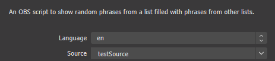
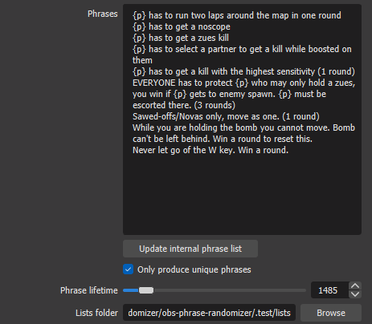
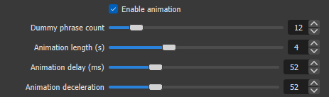
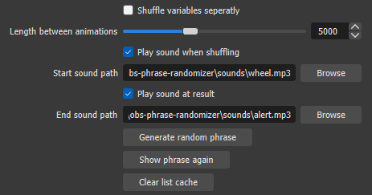

# OBS Phrase Randomizer

An OBS script to show random phrases from a list filled with phrases from other lists. (see examples below for more detail).

### Table of Contents

- [Usage](#usage)
- [Installation](#installation)
	- [Script Installation](#script-installation)
	- [Python Installation](#python-installation)
- [Features and Documentation](#features-and-documentation)

## Usage

Once installed, select a valid source then place phrases in the phrases setting. Phrases will be split on line breaks.

Provide lists by setting your list directory and include `.txt` files. Place wildcards with the lists name in the phrases in the format `{<list_name>:<index>}` to place values.

> i.e. `EVERYONE has to protect {person} who may only hold a zues, you win if {person:1} gets to enemy spawn. {person:1} must be escorted there. (3 rounds)`
>
> - All values will look for a file named `person.txt`.
> - `{person}` Will get replaced with a random person in list every time. If there are multiple instances they can be different, and they can match.
> - `{person:1}` Will be replaced with the 1st index of a shuffled version of your list. This instance will be replaced with the same list value every time.

Comb through the settings to configure timings. All timings are in ms (miliseconds).

For more detailed documentation from settings, see the [Features and Documentation](#features-and-documentation) section. For code documentation, see docstrings included in code.
## Installation

There are two steps to install the script. First, letting OBS know where the script is, then telling OBS where your Python interpreter is. If you've done neither of these please follow the instructions below.

### Script Installation

1. Download code in a directory of your choice by your method of choice. If you don't know how to download, just click the 'Code' button on the GitHub page, and click 'Download ZIP'.

	> *OBS has scripts in `C:\Program Files\obs-studio\data\obs-plugins\frontend-tools\scripts`, but you can put yours wherever you want.*

2. Open your OBS, go to `tools`>`scripts` in the menu bar.

3. Click the + button in the bottom left, and browse to your script directory. Select the file `phrase-randomizer.py`.

### Python Installation

If you haven't already, you'll need to add a Python interpreter to OBS to run the script.

1. Download [Python 3.6.x](https://www.python.org/downloads/release/python-368/). Scroll down and download a 64 bit installer for your OS i.e. `Windows x86-64 executable installer`. Make sure to note where you install Python. Confirm that 'Add Python 3.6 to PATH' is checked, and click 'Install Now'.

	

2. Once this is downloaded, you'll want to add the Python app to OBS by going to the 'Python Settings' tab in the `tools`>`scripts` menu. Click browse and select the FOLDER that contains your `python.exe` file. In my case, it's in my local AppData folder.

	

## Features and Documentation

Below is a small description of all the script settings. Default values can be found in the Data module section of the [script](phrase-randomizer.py). All code documentation is in docstring version in code.

### Script setup

> 

 - __Language__: Will update text in the settings panel with different languages. Currently only has support for english.
 - __Source__: The text source to update when shuffling phrases. This must be a text element. This dropdown is populated with valid sources.

### Phrases settings

> 

- __Phrases__: A list of phrases to choose from, seperated by line breaks. To include a line break in the phrase itself, use `\n`.
	- To insert data from a list, see the files in your list directory. Expects tags in the form `{<list_name>:<index>}` where `<list_name>` is the name of your `.txt` file in your list directory, and `<index>` will let you set phrases to include the same list variable.
	- i.e.
		- `{person:1} must protect {person:2} until the end of the round.` Will result in `{person:1}` and `{person:2}` being different values in the list named `p.txt` (as long as there are atleast two values)
		- `{person} must buy {person} a gun to use this round.` lets `{person}` by ANY value. This means that there is a chance that it will be the same value.
		- *__Note__: If you provide an index larger than the number of values in your list, the index will wrap as a remainder. i.e. if your list contains 6 values and you provide an index of 8, this will provide the same index as index 2. (It won't fail if you have an index out of range)*
- __Update internal phrase list__: If 'Only produce unique phrases' is checked, this will reset the interal list of used phrases to empty, allowing all phrases to be used again.
- __Only produce unique phrases__: Will keep track of which phrases have been used and not show them again. Will reset once the phrases list gets to 1. This can be updated in code if you want.
- __Phrase lifetime__: The time that the phrase will live on screen before disappearing.
- __Lists folder__: The directory in which your lists are included. They must be direct children in this directory, not stored in a folder.

### Animation settings

> 

- __Enable animation__: Will enable playing the animation when requesting a new phrase.
- __Dummpy phrase count__: Will determine how many phrases are generated for the animation. This list is only pulled from the internal phrase list, so if requesting unique phrases, seen phrases will not be seen in the animation.
- __Animation length__: Duration in ms that the animation will play for. If you're playing sound, I would make this about the same duration. This is not exact as it's running on a loop and using pythons' sleep function.
- __Animation Delay__: A delay, in ms, that's played before the animation is played. This only plays before the first animation if we're shuffling list values seperately.
- __Animation deceleration__: An obscure value that changes the scale at which the animation decelorates. I've just cherry picked the default value of 52, but anything from 40-80 typically works fine. You're welcome to play with this.

### Sound and MISC settings

> 

- __Shuffle variables seperately__: Will play a seperate animation for shuffling the list values. The first animation will pull from the list of internal phrases with the wildcards intact i.e. `{p}`. Once a phrase is chosen, another animation will play with many variations of that phrase but with different randomizations of the list values.
	
- __Length between animations__: Duration, in ms, that will seperate the two animations if 'shuffle variables seperately' is checked.
- __All Sound Settings__: Enables sounds playing at the start and end of the animation. Will play for both animations. Start sound will play even if animation isn't enabled. Browse to a custom audio file or use the ones included.
- __Generate random phrase__: Manual button to generate a random phrase. There is also a hotkey that can be registered with the same name.
- __Show phrase again__: The text element selected will only disappear when the phrase lifetime ends. Pressing this button (or hitting the set hotkey) will show the phrase again for phrase lifetime again.
- __Clear lists cache__: If a list is updated while the script is running, or if there are performance issues from so many lists loaded into memory, this will completly wipe all the lists that have been loaded.