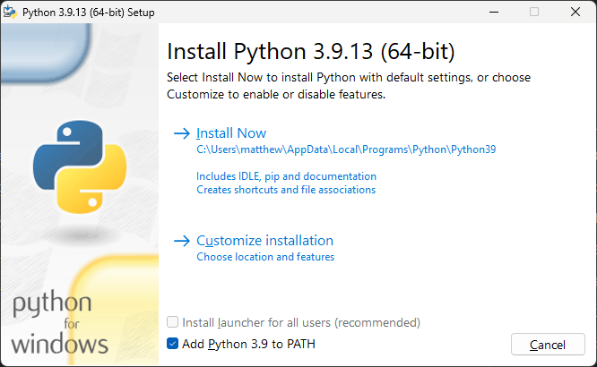
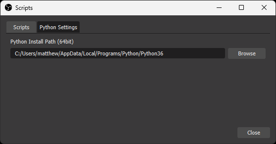

# OBS Phrase Randomizer

An OBS script to show random phrases from a list filled with phrases from other lists. (see examples below for more detail).

### Table of Contents

- [Features](#features)
- [Installation](#installation)
	- [Script Installation](#script-installation)
	- [Python Installation](#python-installation)

### Features

- Simple shuffle animation with slight customization
- Optional sound effect on result
- Hotkeys support (you can set hotkeys in OBS preferences)
- Persistant settings

# Installation

There are two steps to install the script. First, letting OBS know where the script is, then telling OBS where your Python interpreter is. If you've done neither of these please follow the instructions below.

### Script Installation

1. Download code in a directory of your choice by your method of choice. If you don't know how to download, just click the 'Code' button on the GitHub page, and click 'Download ZIP'.

	> *OBS has scripts in `<OBS_Install_Folder>/data/obs-plugins/frontend-tools/scripts/`, but you can put yours wherever you want.*

2. Open your OBS, go to `tools`>`scripts` in the menu bar.

3. Click the + button in the bottom left, and browse to your script directory. Select the file `phrase-randomizer.py`.

### Python Installation

If you haven't already, you'll need to add a Python interpreter to OBS to run the script.

1. Download [Python 3.6.x](https://www.python.org/downloads/release/python-368/). Scroll down and download a 64 bit installer for your OS. Make sure to note where you install Python. Confirm that 'Add Python 3.6 to PATH' is checked, and click 'Install Now'.

	

2. Once this is downloaded, you'll want to add the Python app to OBS by going to the 'Python Settings' tab in the `tools`>`scripts` menu. Click browse and select the FOLDER that contains your `python.exe` file. In my case, it's in my local AppData folder.

	

